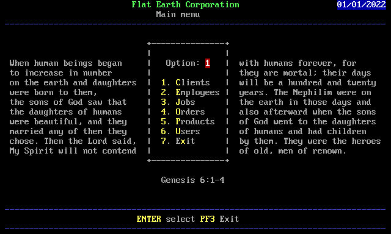
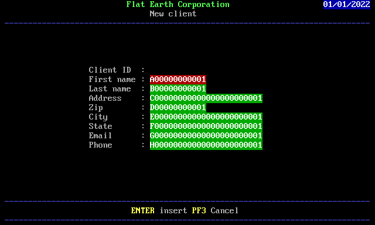
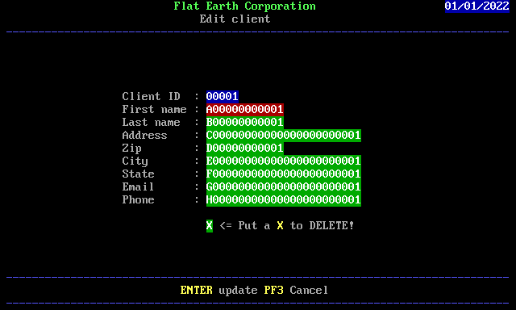

# REST API

** Partially working **

Author: Frank

Project target is to implement a REST API for C in MVS3.8j

## Checklist
1. Create Python backend (100%)
2. Create MVS client (30%)

## Warning
- This project is not safety for production. It is SQL Injection vulnerable.

### Project 06_database
- Run ./01_initdb_sqlite.py to init db.sqlite3 database.
- Run ./02_start_server.py to start REST API server.
- Run ./03_test.sh to test API server (optional).
### Project 17_rest
- Run 'make deps' to compile 08_fss and 15_tcpip.
- Run 'make screens' to convert ANSI files to FSS C files.
- Run 'make' to install REST program into MVS.
- Inside MVS, run 'TSO REST'

## API
- See http://localhost:3000/ - API description

## Screens

Under construction ... (old animated gif :)

### Main menu

|  |
| ------ |

### Client list

|  |
| ------ |

### New client

|  |
| ------ |

### Edit client

|  |
| ------ |