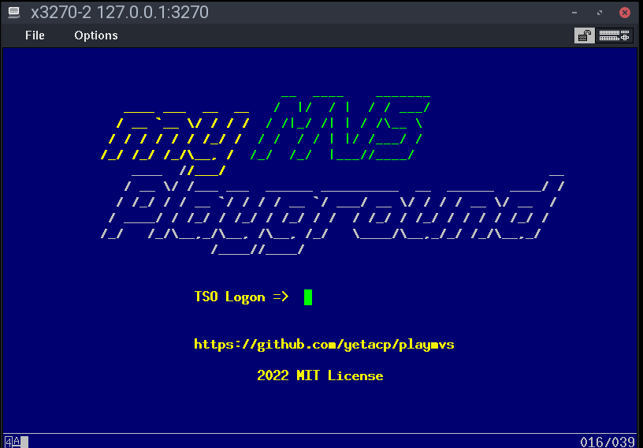
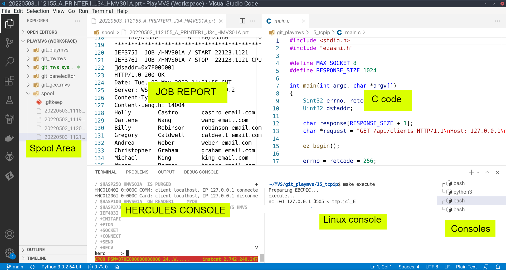
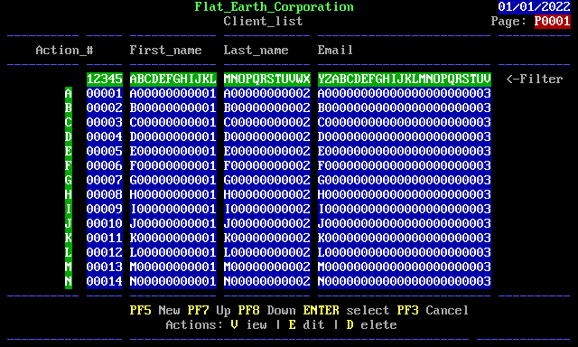

# My MVS Playground

|  |
| ------ |

## Workflow

|  |
| ------ |

TODO...

## Acknowledgements
```
If I have seen a little further it is by standing on the shoulders of Giants.
Isaac Newton.
```

- First and foremost, I would like to thank Volker Bandke (TK3), [Juergen Winkelmann](https://wotho.ethz.ch/tk4-/), [Jay Moseley](http://www.jaymoseley.com/) and [Moshix](https://www.youtube.com/c/moshix/videos).

## About
- This is my playground to learn MVS3.8j/TK4- environment and to test C projects using Linux GCCMVS cross-compiler for MVS.

## *Dependencies*

- A MVS3.8j system: 
    - [myMVS](https://github.com/yetacp/mymvs)
    - [TK4-](https://wotho.ethz.ch/tk4-/). 
- [GCC C cross-compiler for MVS](https://github.com/yetacp/gcc_mvs).

- Use [MVS sysgen](https://github.com/yetacp/mvs_sysgen) to generate a custom MVS3.8j.

## Projects in progress

- Small programs to demonstrate C programming in MVS.
- A C implementation of VSAM API.
- A web panel editor for FSS API (C Full Screen Interface).
- A LUA port for MVS.
- A database API using TCP/IP interface (EZASMI). A simplified Python script will provide a socket server for database services.

## Ideas
- Create a client DB API for MVT Cobol, like Jay Moseley's VSAMIOS.
- A decimal math library similar to COBOL for C.

## Playground projects

- This folder contains some programs to test C programming in MVS.
 
- These programs are compiled inside **Linux** using GCCMVS to generate source code in assembly.

- I use jobs to send these source code to MVS through Hercules sockdevs (3505 card readers).

- Assembling (IFOX00) and linkediting (IEWL) are executed inside **MVS**.

### [01_adder](01_adder)

- C program to receive 2 numbers from JCL and add them.

### [02_multiple](02_multiple)

- I cross-compile two C programs in **Linux** to assembly source code.
- Generated assembly code is compiled using IFOX00 in **MVS**.
- After, modules are linked using IEWL in **MVS**.

### [03_fileio](03_fileio)

- C program to read and print a dataset declared in DD JCL.

### [04_vm](04_vm)

- A tiny toy virtual machine written in C.
- A Fibonnaci algorithm is hard coded in vmcode.c file.

### [05_netsol](05_netsol)
- How to replace logon screen. I am using [ANSI2EBCDIC project](https://github.com/yetacp/ANSi2EBCDiC).

### [06_database](06_database)
- A small Python+SQLite database providing a REST API.

### [07_vsam](07_vsam) 

- A partial C implementation of VSAM API.
- Author: myself
- Only KSKDS works

### [08_fss](08_fss)

- Full screen MVS programs using amazing [Tommy Sprinkle's "C Full Screen Service API"](http://tommysprinkle.com/mvs/fss/using.html).

- [hello](09_fss_01_hello) - Another ye olde Hello World.
- [hello 2](10_fss_02_hello) - Yet another ye olde Hello World with colors.
- [login](11_fss_03_login) - Read a username and password.
- [panel](12_fss_04_panel) - Use Scruples editor to create a complex panel.
- [menu](13_fss_05_menu)  - A menu example using a panel.

### 14_lua (It is not working)
- Yet another not working MVS port of Lua 5.4.
- You can find a [working port here](https://github.com/HackerSmacker/Lua370).

### [15_tcpip](15_tcpip)
- A C-wrapper for EZASMI API and a TCP/IP sample

### [16_mvsddt](16_mvsddt)
- Using MVSDDT to debug a assembly program.

### [17_rest](17_rest)
- Frontend: a small program with screens using FSS and a TCP/IP client using EZASMI.
- Backend: a REST API server using a SQLite database to provide persistence.

|  |
| ------ |
